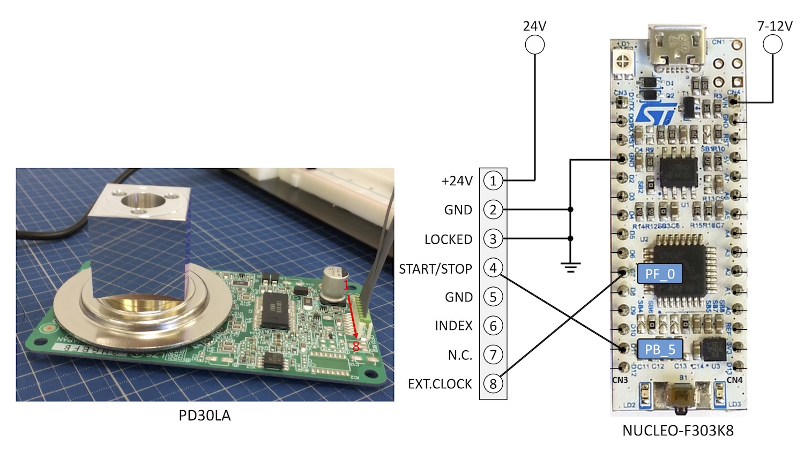

# PD30LA Mbed

Control polygon laser scanner ([Nidec, PD30LA](https://www.nidec-copal-electronics.com/us/product/list/017/)) via [NUCLEO-F303K8](https://os.mbed.com/platforms/ST-Nucleo-F303K8/).



```cpp
#include "mbed.h"
#include "pd30la.h"

PD30LA pd30la = PD30LA(PB_5, PF_0); // pinStartStop, pinExtClock

int main()
{
    pd30la.setRotationSpeed(2000.0f); // [r/min]
    
    while (1) {
        pd30la.start();
        wait(2);
        pd30la.stop();
        wait(2);
    }
}
```